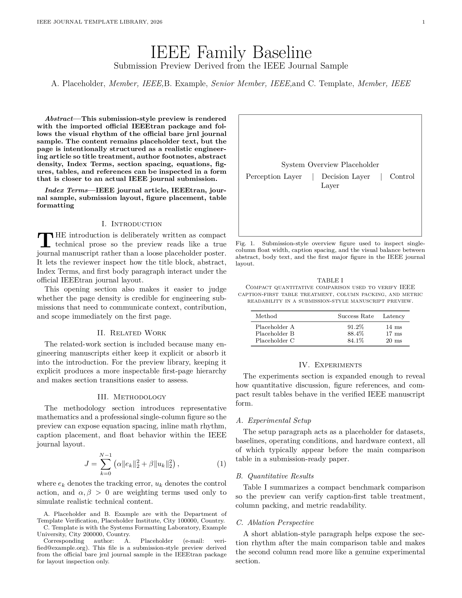
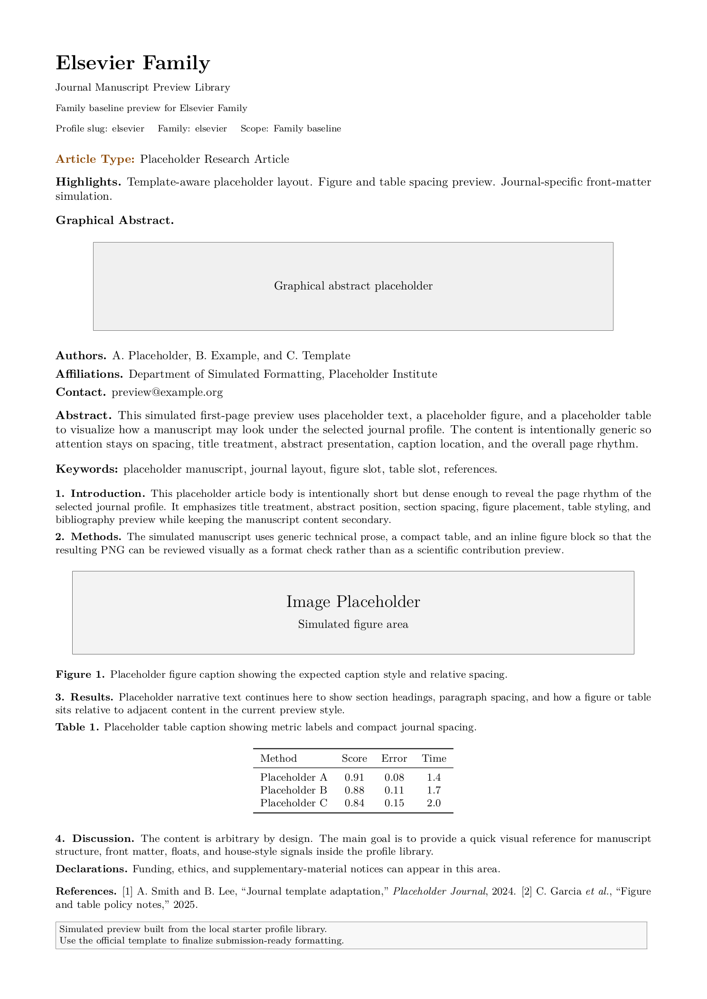
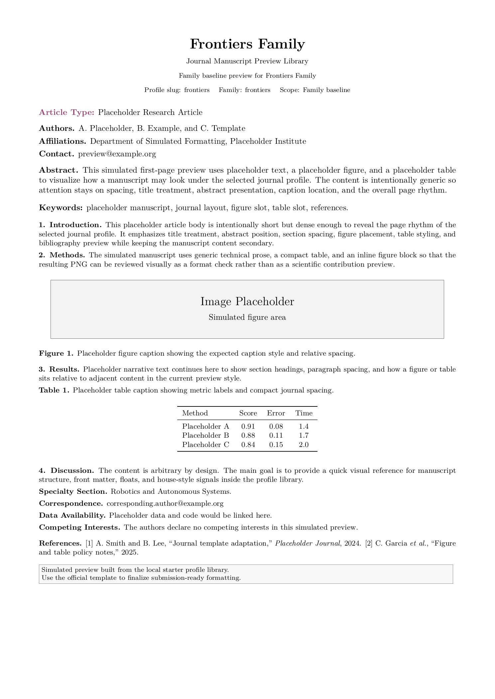
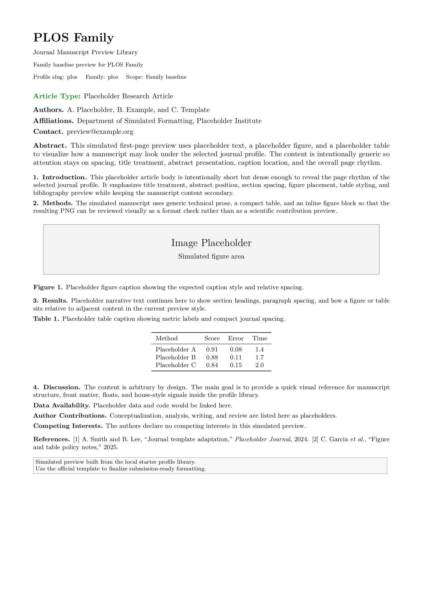

# Journal Manuscript

[English](README.md) | [Chinese](README.zh-CN.md)

    

Journal Manuscript is a Codex skill package for journal manuscript drafting, template-preserving revision, and venue migration. The repository is organized around publisher-family baselines, journal-specific overlays, and explicit verification records. In the consuming workspace, the default drafting anchor is the official IEEE journal-family LaTeX baseline (`IEEEtran`); additional venue constraints are applied only when they are documented in a profile or verified against local official-template assets.

## Distribution Modes

- Full library: the complete family and journal catalog for maintainers, research groups, or multi-venue workflows.
- Minimal family package: an end-user download that contains the installable `journal-manuscript/` skill package, the selected family library, the required family-level guide/template assets, and the child journals that inherit from that family.

## Coverage Snapshot

- 28 family-level baselines
- 87 journal-level profiles
- 115 standardized `official_preview.tex/.pdf/.png` sets
- 66 verification records
- 65 verified official-template targets
- 1 blocked target that still needs a missing official template asset

The main index lives in `journal-manuscript/references/journals/catalog.md`. All profile folders now use `official_preview.*` as the canonical rendered asset name; verification level is determined by `verification.yaml`.

## Verification Model

- Standard profile tier: folders without a verification record still ship `profile.md` plus `official_preview.*` as conservative display assets.
- Official-template tier: journals with `verification.yaml` declare what has been verified, what remains manual, and use `official_preview.*` as the rendered official asset set.
- Blocked tier: journals missing a local official template asset stay explicitly marked as `blocked` instead of being overstated as verified.

## Family-Level Baseline Reuse

- Some publisher families can safely reuse one family-level template baseline across sibling journals during drafting and preview.
- This reuse policy does not mean every sibling journal has identical submission rules; the journal-specific author page still overrides the family-level baseline.
- For the current family-level baseline reuse policy, see `journal-manuscript/references/journals/family-template-sharing-tiers.md` and `journal-manuscript/references/journals/family-template-sharing-tiers.yaml`.

This package is intentionally conservative. It provides a broad starter library, but it does not claim that every journal rule has already been fully audited.

## Core Use Cases

- draft or revise sections while preserving the active manuscript voice and structure
- integrate figures, tables, captions, and equations without destabilizing layout
- keep citation style, cross-references, and end matter aligned with the target venue
- migrate an IEEE-based manuscript toward another journal template using verified differences

## Package Layout

```text
Journal-manuscript/
├── README.md
├── README.zh-CN.md
├── .gitignore
└── journal-manuscript/
    ├── SKILL.md
    ├── agents/
    │   ├── openai.yaml
    │   ├── shared-journal-loading.yaml
    │   ├── provider-portability.yaml
    │   ├── anthropic.yaml
    │   ├── gemini.yaml
    │   ├── openrouter.yaml
    │   ├── local-llm.yaml
    │   └── README.md
    ├── references/
    │   ├── house-style.md
    │   ├── journal-profiles.md
    │   └── journals/
    │       ├── catalog.md
    │       ├── official-template-verified-targets.md
    │       ├── README.md
    │       ├── ieee/
    │       ├── elsevier/
    │       ├── springer/
    │       ├── mdpi/
    │       └── ...
    └── scripts/
        ├── README.md
        ├── export_selective_skill_bundle.py
        ├── render_profile_preview_assets.py
        └── render_official_template_preview_assets.py
```

## Consumer Manuscript Contract

When this skill is used inside a manuscript repository, it expects the paper-side paths to look like:

- `paper/main.tex`
- `paper/references.bib`
- `paper/CAPTION_BANK.md`
- `paper/tables/`
- `paper/figures/`

These are consumer-workspace targets, not files bundled inside this skill package. If the target manuscript uses another directory layout, resolve the equivalent files first and keep the same functional roles.

## Official Preview Gallery

The gallery below intentionally uses family-level official preview assets so the README reflects reusable publisher baselines rather than child-journal examples.

<table>
  <tr>
    <td align="center" valign="top">
      <strong>IEEE Family</strong><br/>
      <br/>
      Verified family baseline built from the imported IEEEtran package path, with journal-specific tightening deferred to each child profile.
    </td>
    <td align="center" valign="top">
      <strong>Elsevier Family</strong><br/>
      <br/>
      Official Elsevier family baseline preview showing the reusable author-manuscript layout before journal-specific citation or declaration rules are layered in.
    </td>
  </tr>
  <tr>
    <td align="center" valign="top">
      <strong>Frontiers Family</strong><br/>
      <br/>
      Official Frontiers package preview preserving specialty metadata, correspondence, and declaration-heavy open-science structure at the family level.
    </td>
    <td align="center" valign="top">
      <strong>PLOS Family</strong><br/>
      <br/>
      Official PLOS family baseline preview showing the manuscript-style reporting flow reused before title-specific requirements are applied.
    </td>
  </tr>
</table>

For the full library, browse `journal-manuscript/references/journals/` directly. Every family folder and journal folder contains `profile.md` and `official_preview.*`. Folders with a verification record also contain `verification.yaml`, and their verification scope defines whether the rendered asset is a conservative display page, an official family-template rendering, an official template-package rendering, or a blocked placeholder. For any cross-journal reuse of a family-level baseline, consult `family-template-sharing-tiers.*` first.

## Maintenance Scripts

- `journal-manuscript/scripts/export_selective_skill_bundle.py`: builds a minimal distributable package that contains the selected family or journal library together with the required template assets.
- `journal-manuscript/scripts/render_profile_preview_assets.py`: renders standardized `official_preview.*` assets for folders without `status: verified`.
- `journal-manuscript/scripts/render_official_template_preview_assets.py`: refreshes verified `official_preview.*` assets and verification records for curated journals.
- `journal-manuscript/scripts/README.md`: documents naming rules, output contracts, and typical commands.

## Installation

For maintainers or users who need the complete catalog, clone this repository or download the full ZIP archive. Then copy the inner `journal-manuscript/` folder into your Codex skills directory:

- Windows: `C:\Users\<username>\.codex\skills\journal-manuscript`
- macOS/Linux: `~/.codex/skills/journal-manuscript`

The packaged skill is not limited to one model family. The same install contains native Codex/OpenAI support plus portability configs for Claude, Gemini, OpenRouter, and local LLM wrappers under `journal-manuscript/agents/`.

After installation, enable it through your Codex configuration and restart the client if needed. If you are using a non-Codex wrapper, point that wrapper at the same installed `journal-manuscript/` skill folder so it can reuse the shared journal-loading rules and profile metadata.

If you want end users to download only one publisher family, use the minimal family package flow below instead of shipping the full library.

## Minimal Family Packages

Minimal family packages are the recommended download format for end users. Each package contains:

- the installable `journal-manuscript/` skill package
- the selected family library under `references/journals/<family>/`
- the family-level guide and template assets referenced by that family
- the child journal profiles that inherit from that family
- a package README plus `bundle-manifest.json` that records the included scope

This is the supported way to let users download the corresponding family library, the matching family template assets, and the usable Codex skill in one package.

Click a family link below to download the corresponding minimal installation ZIP directly:

| Family | Download |
| --- | --- |
| `aaas` | [AAAS Family](https://github.com/amine123max/JournalManuscript/releases/latest/download/journal-manuscript-family-aaas.zip) |
| `acm` | [ACM Family](https://github.com/amine123max/JournalManuscript/releases/latest/download/journal-manuscript-family-acm.zip) |
| `acs` | [ACS Family](https://github.com/amine123max/JournalManuscript/releases/latest/download/journal-manuscript-family-acs.zip) |
| `aip` | [AIP Family](https://github.com/amine123max/JournalManuscript/releases/latest/download/journal-manuscript-family-aip.zip) |
| `bmc` | [BMC Family](https://github.com/amine123max/JournalManuscript/releases/latest/download/journal-manuscript-family-bmc.zip) |
| `cambridge` | [Cambridge Family](https://github.com/amine123max/JournalManuscript/releases/latest/download/journal-manuscript-family-cambridge.zip) |
| `cell-press` | [Cell Press Family](https://github.com/amine123max/JournalManuscript/releases/latest/download/journal-manuscript-family-cell-press.zip) |
| `copernicus` | [Copernicus Family](https://github.com/amine123max/JournalManuscript/releases/latest/download/journal-manuscript-family-copernicus.zip) |
| `custom-journal` | [Custom Journal Family](https://github.com/amine123max/JournalManuscript/releases/latest/download/journal-manuscript-family-custom-journal.zip) |
| `de-gruyter` | [De Gruyter Family](https://github.com/amine123max/JournalManuscript/releases/latest/download/journal-manuscript-family-de-gruyter.zip) |
| `elsevier` | [Elsevier Family](https://github.com/amine123max/JournalManuscript/releases/latest/download/journal-manuscript-family-elsevier.zip) |
| `emerald` | [Emerald Family](https://github.com/amine123max/JournalManuscript/releases/latest/download/journal-manuscript-family-emerald.zip) |
| `frontiers` | [Frontiers Family](https://github.com/amine123max/JournalManuscript/releases/latest/download/journal-manuscript-family-frontiers.zip) |
| `hindawi` | [Hindawi Family](https://github.com/amine123max/JournalManuscript/releases/latest/download/journal-manuscript-family-hindawi.zip) |
| `ieee` | [IEEE Family](https://github.com/amine123max/JournalManuscript/releases/latest/download/journal-manuscript-family-ieee.zip) |
| `iop` | [IOP Family](https://github.com/amine123max/JournalManuscript/releases/latest/download/journal-manuscript-family-iop.zip) |
| `mdpi` | [MDPI Family](https://github.com/amine123max/JournalManuscript/releases/latest/download/journal-manuscript-family-mdpi.zip) |
| `nas` | [NAS Family](https://github.com/amine123max/JournalManuscript/releases/latest/download/journal-manuscript-family-nas.zip) |
| `nature-portfolio` | [Nature Portfolio Family](https://github.com/amine123max/JournalManuscript/releases/latest/download/journal-manuscript-family-nature-portfolio.zip) |
| `optica-publishing` | [Optica Publishing Group Family](https://github.com/amine123max/JournalManuscript/releases/latest/download/journal-manuscript-family-optica-publishing.zip) |
| `oxford` | [Oxford Family](https://github.com/amine123max/JournalManuscript/releases/latest/download/journal-manuscript-family-oxford.zip) |
| `plos` | [PLOS Family](https://github.com/amine123max/JournalManuscript/releases/latest/download/journal-manuscript-family-plos.zip) |
| `royal-society` | [Royal Society Family](https://github.com/amine123max/JournalManuscript/releases/latest/download/journal-manuscript-family-royal-society.zip) |
| `sage` | [SAGE Family](https://github.com/amine123max/JournalManuscript/releases/latest/download/journal-manuscript-family-sage.zip) |
| `siam` | [SIAM Family](https://github.com/amine123max/JournalManuscript/releases/latest/download/journal-manuscript-family-siam.zip) |
| `springer` | [Springer Family](https://github.com/amine123max/JournalManuscript/releases/latest/download/journal-manuscript-family-springer.zip) |
| `taylor-francis` | [Taylor and Francis Family](https://github.com/amine123max/JournalManuscript/releases/latest/download/journal-manuscript-family-taylor-francis.zip) |
| `wiley` | [Wiley Family](https://github.com/amine123max/JournalManuscript/releases/latest/download/journal-manuscript-family-wiley.zip) |

If you need to regenerate or refresh a package locally, use:

```powershell
python journal-manuscript/scripts/export_selective_skill_bundle.py --family ieee --archive
```

Typical examples:

```powershell
python journal-manuscript/scripts/export_selective_skill_bundle.py --family ieee --archive
python journal-manuscript/scripts/export_selective_skill_bundle.py --family elsevier --archive
python journal-manuscript/scripts/export_selective_skill_bundle.py --family frontiers --archive
```

End-user installation is straightforward: click the ZIP link, extract it if needed, and copy the inner `journal-manuscript/` folder into the Codex skills directory. If you rebuild the same package name locally, use `--force` to replace the previous output.

## Family Scaffold

The repository now also supports creating a fresh `paper/` starter workspace directly from a supported family template baseline.

Typical examples:

```powershell
python journal-manuscript/scripts/scaffold_family_manuscript.py --family ieee --output-dir C:\work\ieee-paper
python journal-manuscript/scripts/scaffold_family_manuscript.py --family frontiers --output-dir C:\work\frontiers-paper
```

What the scaffold creates:

- `paper/main.tex`
- `paper/references.bib`
- `paper/CAPTION_BANK.md`
- `paper/README_PAPER.md`
- `paper/figures/`
- `paper/tables/`
- `paper/tables/generated/`

Supported scaffold families in the current script:

- `ieee`
- `elsevier`
- `springer`
- `frontiers`
- `plos`
- `wiley`
- `acs`
- `aip`

Recommended usage flow:

1. Generate the family scaffold.
2. Use `$journal-manuscript` with `journal=<family-slug>` to turn the family sample into your first clean draft.
3. Switch to `journal=<journal-slug>` when you want to tighten the manuscript toward a specific target journal.

## Choose The Journal Skill You Need

Distribution happens at the family-package level, but runtime behavior is still selected at the journal-profile level.

Recommended flow:

1. Identify the target journal, or at least the publisher family, of the paper you want to draft or revise.
2. Install the matching minimal family package, or use the full library if you need broader coverage.
3. Open `journal-manuscript/references/journals/catalog.md` and find the matching journal slug.
4. Invoke the skill with `journal=<journal-slug>` so the skill loads the matching profile, preview assets, and verification metadata.
5. If the exact journal is not included yet, start from the closest family folder under `journal-manuscript/references/journals/` or use `custom-journal/`.

Typical examples:

- A robotics paper targeting IEEE Transactions on Robotics: use `journal=ieee-tro`
- A marine paper targeting Ocean Engineering: use `journal=ocean-engineering`
- An interdisciplinary open-access paper targeting PLOS ONE: use `journal=plos-one`

In other words, users download a minimal family package, while the paper-specific behavior is still selected by the journal profile you pass at runtime.

## Quick Start

If you already have a target paper or journal, use this shortcut:

1. Find the journal name from the paper PDF first page, journal website, or submission system.
2. Search that journal name in `journal-manuscript/references/journals/catalog.md`.
3. Copy the matching slug and call the skill with `journal=<journal-slug>`.

Important: do not use the paper title itself as the slug. Use the venue name shown by the paper.

Reverse-lookup examples:

- `IEEE Transactions on Robotics` -> `ieee-tro`
- `IEEE Journal of Oceanic Engineering` -> `ieee-joe`
- `Ocean Engineering` -> `ocean-engineering`
- `Frontiers in Neurorobotics` -> `frontiers-in-neurorobotics`
- `PLOS ONE` -> `plos-one`

If you only know the publisher family, start from the corresponding family profile in the catalog, such as `ieee`, `elsevier`, `springer`, `wiley`, `frontiers`, or `plos`. If no exact journal exists yet, use the closest family profile or `custom-journal/`.

If you are preparing a minimal package for distribution, pass the relevant family or journal slug directly to `export_selective_skill_bundle.py` so the generated package includes only the needed journal style assets.

Copyable prompt examples:

```text
Use $journal-manuscript with journal=ieee-tro task="Revise the related work section in the style of the current manuscript."
Use $journal-manuscript with journal=ocean-engineering task="Reformat the paper toward the target journal submission style."
Use $journal-manuscript with journal=plos-one task="Check whether the manuscript structure matches the target journal flow."
```

## Usage

Use one shared invocation contract across providers:

```text
skill=journal-manuscript journal=<journal-slug> task="<what to do>"
```

Examples:

- OpenAI / Codex: `Use $journal-manuscript with journal=ieee-tro task="Rewrite the Introduction in the same style as the current paper."`
- Claude wrapper: `skill=journal-manuscript journal=ocean-engineering task="Reformat the manuscript toward Elsevier submission style."`
- Gemini wrapper: `skill=journal-manuscript journal=frontiers-in-neurorobotics task="Adapt the abstract and end sections to the target journal."`
- Local LLM gateway: `skill=journal-manuscript journal=plos-one task="Check whether the manuscript structure matches the official template flow."`

Shared loading behavior:

- Every provider should resolve the selected journal through `journal-manuscript/agents/shared-journal-loading.yaml`.
- This ensures the same journal profile, verification metadata, and fallback rules are used when switching providers.

## Notes

- The published skill name shown to users is `Journal Manuscript`.
- The internal Codex skill folder name is `journal-manuscript`, which is the valid trigger form.
- The package defaults to the official IEEE journal-family LaTeX baseline (`IEEEtran`) in the consuming workspace, then layers additional journal-specific requirements when needed.
- The expanded journal library is intentionally broad, but only journals with verification records should be treated as officially audited paths.
- Native Codex support still comes from `agents/openai.yaml`; the other files in `agents/` are portability configs for Claude, Gemini, OpenRouter, and local LLM wrappers rather than native Codex schema files.

## License

This repository is released under the MIT License. See `LICENSE`.


